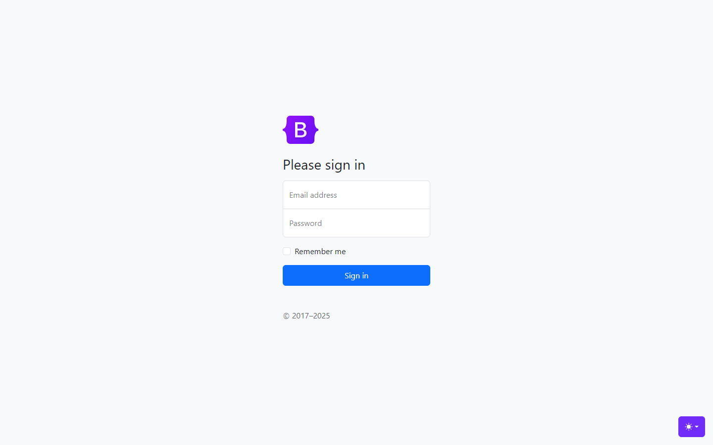
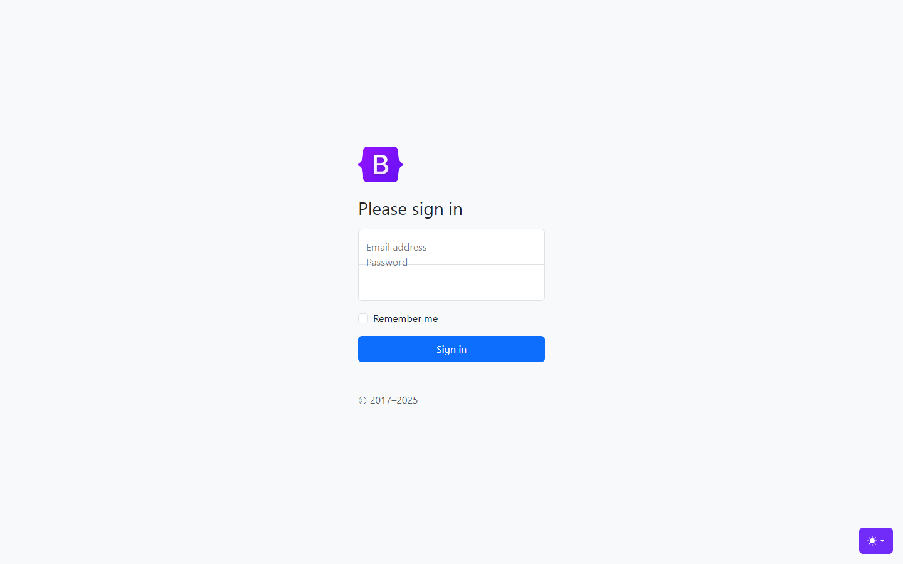

# omnisight-forge

Trainable, measurable UI self-healing: a synthetic UI-bug factory, a fine-tuned
vision-language healer, an anti-cheat verifier, and the UI-HealBench benchmark.

Forge builds on OmniSight (a multimodal UI self-healing and RPA agent). Its goal is
to make the healing model trainable and measurable instead of relying on prompt
engineering alone.

## Status

Early development. Work is tracked in GitHub milestones:

- v0.1 Bug Factory (done)
- v0.2 Healer
- v0.3 Verifier
- v0.4 Dashboard / Flywheel

The bug types and their gold fixes are defined in [docs/BUG_TAXONOMY.md](docs/BUG_TAXONOMY.md).

## What the bug factory produces

The factory loads a real page, breaks one element with a verified CSS mutation
(overflow, overlap or clipping), and stores the clean screenshot, the broken
screenshot, the broken DOM and the exact CSS fix that reverses the bug. Every bug is
checked with geometry, lands only on elements visible in the screenshot, and can be
reproduced from a seed.

Example: a form label pushed up by 33px so it overlaps the label above it.

| Clean | Broken |
| --- | --- |
|  |  |

Build a dataset from the Bootstrap example pages (MIT licensed):

```powershell
.\.venv\Scripts\python.exe -m forge.build `
  --site album=https://getbootstrap.com/docs/5.3/examples/album/ `
  --site pricing=https://getbootstrap.com/docs/5.3/examples/pricing/ `
  --site sign-in=https://getbootstrap.com/docs/5.3/examples/sign-in/ `
  --site blog=https://getbootstrap.com/docs/5.3/examples/blog/ `
  --seeds 3
```

Output goes to `data/samples.jsonl` and `data/raw/`, both ignored by git. The first
full run kept 83 of 108 attempts after the quality filter.

## Results

Qwen3-VL-4B fine-tuned with LoRA, tested on held-out sites it never saw in training. Full
tables and notes are in [docs/RESULTS.md](docs/RESULTS.md).

| run | test sites (samples) | zero-shot 4B | fine-tuned 4B |
| --- | --- | --- | --- |
| 1 | sign-in (15) | 0% | 73% |
| 2 | sign-in + wiki (20) | 0% | 15% |
| 3 | sign-in + wiki (19) | 0% | 32% (sign-in 100%, wiki 0%) |
| 4 | sign-in + wiki (21) | 14% | 43% (sign-in 100%, wiki 20%) |

Since run 4 the healer names the broken element by a number instead of writing a selector,
which took Wikipedia from 0% to 20%. Most remaining errors are values that differ from the
original; a browser verifier (#35) will check whether such fixes still repair the page.

## Setup

Requires Python 3.10 or newer (developed on 3.12).

```powershell
git clone https://github.com/Ankit-builds1/omnisight-forge.git
cd omnisight-forge
py -3.12 -m venv .venv
.\.venv\Scripts\python.exe -m pip install -e ".[dev]"
.\.venv\Scripts\python.exe -m pip install -r requirements.txt
.\.venv\Scripts\python.exe -m playwright install chromium
```

## Run tests and lint

```powershell
.\.venv\Scripts\python.exe -m pytest
.\.venv\Scripts\python.exe -m ruff check .
```

## Workflow

`main` is protected. All changes go through `feat/<name>` branches and pull
requests, with conventional commit messages.

## License

Copyright (c) 2026 Ankit Dash. All Rights Reserved. See [LICENSE](LICENSE).